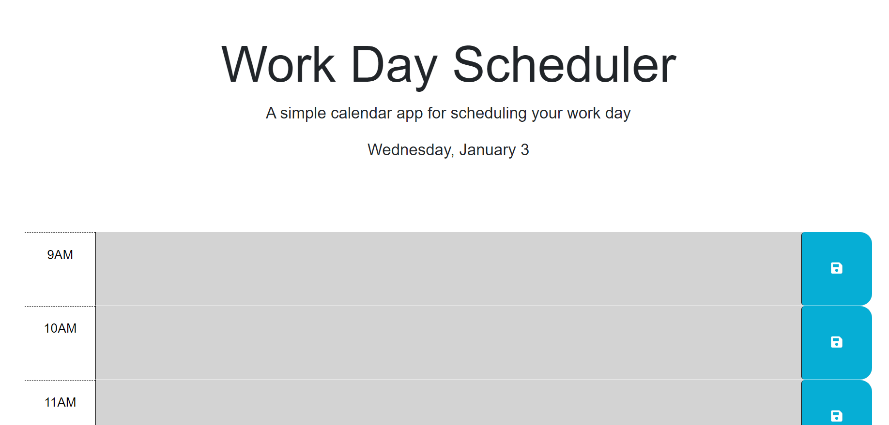
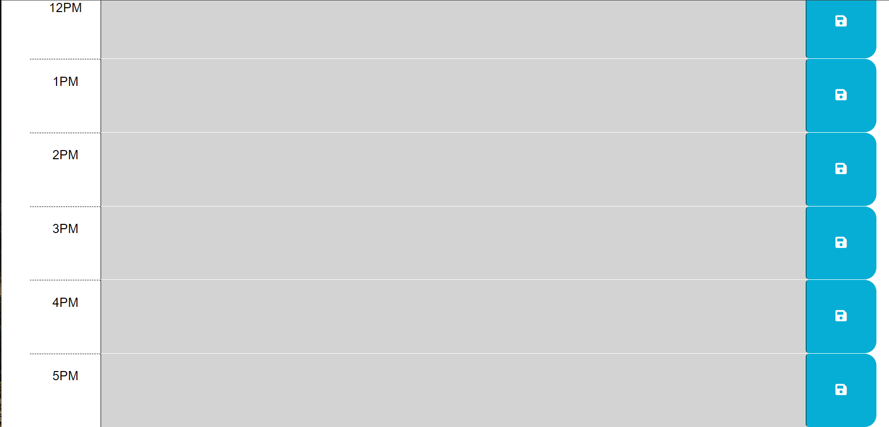

# Daily Planner 
### In this project, I created a daily planner website that uses jquery, dayjs, and local storage to let users create and save an hourly day planner. 

### Features 
- The current date and time 
- Color coded time-blocks for past, present, and future events
- Ability to save user input to the user's local storage

## 
## 

## [Deployed Application (click here)](https://ccarroll929.github.io/daily-planner/) 

## Installation: 
- [Visual Studio Code](https://code.visualstudio.com/download)
- [Git for Windows](https://gitforwindows.org/)